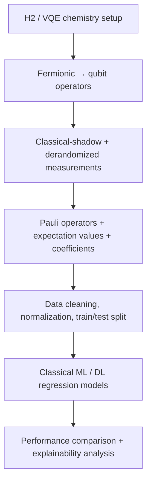

<p align="center">
	<a href="https://www.flaticon.com/free-icon/microprocessor_5905354?term=quantum&page=1&position=3&origin=search&related_id=5905354" title="Microprocessor icon - Flaticon" target="_blank" rel="noopener">
		
	</a>
</p>

<h1 align="center">Quantum expectation value transformation by machine and deep learning</h1>

<p align="center"><i>Quantum shadow tomography + VQE data generation + classical machine learning/deep learning for expectation value prediction.</i></p>

<p align="center">
	
	
	
	
</p>

<p align="center">
	
	
	
	
	
</p>

## Table of Contents

- 🚀 [Project intro](#project-intro)
- 📊 [Dataset](#dataset)
- 🧪 [Methodology](#methodology)
- ⚙️ [Install methods](#install-methods)
- 🧰 [Tools](#tools)
- 🚀 [Usage](#usage)
- 📈 [Results](#results)
- 🔄 [Project flow](#project-flow)
- 📁 [Project structure](#project-structure)
- 📚 [Further reading & references](#extended-papers-reference-implementations-and-learning-resources)
- 📜 [License](#license)


## 🚀 Project intro

This repository contains thesis work on converting a **quantum expectation value estimation problem** into a **classical ML/DL regression problem**. The study uses **NISQ-era quantum computing**, **classical shadow tomography**, and **VQE-generated data** for the H2 molecular system to train models that predict expectation values from compact classical features rather than relying on very large measurement budgets.

In this workflow, the quantum part generates measurement and Pauli-observable data, while the classical part uses ML/DL methods to learn the mapping from those features to expectation values. The result is a practical bridge between quantum chemistry experiments and classical predictive modeling.

> **Quick visual summary**
> - Focus: quantum measurement data → classical expectation-value prediction
> - Domain: H2 molecular system + VQE + shadow tomography
> - Outcome: regression-style ML/DL modeling and experimental comparison
> - Goal: reduce dependence on large measurement budgets while preserving predictive quality

<h2 id="dataset" style="color:#111827; border-bottom:2px solid #e5e7eb; padding-bottom:6px; margin-top:2rem;">📊 Dataset</h2>

The datasets in this repository are generated from the H2 quantum chemistry workflow and the classical-shadow measurement pipeline used in the thesis.

-- Dataset source: measurement outcomes, Pauli-operator information, and classical-shadow features stored in the experiment folders.
-- Main system studied: H2 (with the thesis also comparing related derandomized and VQE-style experiment variants).
-- Typical features: Pauli observable information, expectation-value features, coefficient terms, and classical-shadow derived representations.
-- Target variable: the expectation value / regression target learned from the generated quantum data.
-- Measurement focus: the thesis emphasizes compact measurement settings and compares different classical-shadow and derandomization strategies rather than using a full exhaustive measurement approach.

### 🧾 Dataset Characteristics

<figure style="text-align:center; margin:8px 0;">
	
	<figcaption style="font-size:90%; margin-top:6px;">Figure: Coefficients vs Number of Values</figcaption>
</figure>

<figure style="text-align:center; margin:8px 0;">
	
	<figcaption style="font-size:90%; margin-top:6px;">Figure: Attribute histograms</figcaption>
</figure>

<h2 id="methodology" style="color:#111827; border-bottom:2px solid #e5e7eb; padding-bottom:6px; margin-top:2rem;">🧪 Methodology</h2>

The thesis follows a compact research pipeline that links quantum measurements to classical prediction:

1. Build the molecular / VQE setting for the H2 system and derive Pauli / fermionic operator representations.
2. Generate measurement outcomes using classical-shadow and derandomized measurement strategies, including comparison against randomized baselines.
3. Convert those outcomes into structured datasets of observable and coefficient features.
4. Train classical ML/DL models (for example, regression and tree-based approaches, with LSTM / Bi-LSTM style experimentation in the related workflow) to predict expectation values.
5. Evaluate the effect of measurement budget, optimizer choices, and data preprocessing on prediction quality.

This is the practical core of the project: turning a quantum expectation-value estimation problem into a classical learning problem that can be studied and compared across multiple experiment versions.

### 🔄 Project flow

**The thesis experiments were conducted according to the following workflow:**




This diagram summarizes the thesis workflow from quantum measurement generation to classical expectation-value prediction and evaluation.

<h2 id="project-structure" style="color:#111827; border-bottom:2px solid #e5e7eb; padding-bottom:6px; margin-top:2rem;">🗂️ Project structure</h2>

```txt
.
├── Classical Machine learning and Deep learning/
│   ├── V13/
│   ├── V14/
│   │   ├── WITH SMAGON/
│   │   └── WITHOUT APPLYING SMAGON/
│   └── V16/
│       ├── WITH SMAGON/
│       └── WITHOUT APPLYING SMAGON/
├── Derandomize Quantam Shadow Tomography/
│   ├── V4/
│   │   ├── CLASSICAL SHADOW/
│   │   └── DERANDOMIZE CLASSICAL SHADOW/
│   └── V6/
└── README.md
```

## ⚙️ Install methods

### Prerequisites

- Python 3.8 or newer
- Git
- Optional: `virtualenv` or `conda` for isolated environments

### 📦 pip / Python (recommended)

Clone the repo, create and activate a virtual environment, then install packages:

```bash
git clone https://github.com/your-username/Transformation-of-Quantum-Expectation-value-problem-to-Classical-ML-and-DL-Problem.git
cd Transformation-of-Quantum-Expectation-value-problem-to-Classical-ML-and-DL-Problem
python -m venv .venv
# Windows
.venv\Scripts\activate
# macOS / Linux
source .venv/bin/activate
pip install --upgrade pip
pip install numpy pandas scikit-learn catboost qiskit qiskit-nature jupyter
```

If a `requirements.txt` is provided, prefer:

```bash
pip install -r requirements.txt
```

### 🧪 Conda (alternative)

```bash
conda create -n qml python=3.10
conda activate qml
pip install --upgrade pip
pip install numpy pandas scikit-learn catboost qiskit qiskit-nature jupyter
```

### Post-install

- Launch Jupyter (optional): `jupyter notebook` or `jupyter lab`
- See experiment folders under `Classical Machine learning and Deep learning/` for runnable scripts and notebooks

### 🚀 Usage

Run the experiment scripts from the relevant folder:

```bash
cd "Classical Machine learning and Deep learning/V13"
python data_acquisition_shadow.py
python prediction_shadow.py
```

You can also open the notebook workflow in the same experiment directory for interactive analysis.

<h2 id="tools" style="color:#111827; border-bottom:2px solid #e5e7eb; padding-bottom:6px; margin-top:2rem;">🧰 Tools</h2>


- **Quantum / chemistry:** Qiskit, Qiskit Nature, VQE setup, fermionic-to-qubit mapping.
- **Data / analysis:** Python, Jupyter, NumPy, Pandas, Matplotlib, Plotly.
- **Machine learning:** Scikit-learn, CatBoost, regression and prediction workflows.
- **Interpretability:** LIME, SHAP, ELI5 for model explanation and insight.
- **Development environment:** VS Code for experiment files, notebooks, and repository organization.
- **Hardware context:** NISQ-era research computing with optional GPU/TPU acceleration for heavier ML tasks.

This toolchain connects the quantum and classical parts of the project in one reproducible pipeline.

<!-- Usage moved under Install methods -->
## 📈 Results and analysis


### 📈 Experimental visualizations

<div style="height:16px;"></div>
The following plots visualize the results obtained from the conducted experiments.


**Derandomized classical shadow tomography**

<figure style="text-align:center; margin:8px 0 24px 0;">
	
	<figcaption style="font-size:90%; margin-top:6px;">Figure: Derandomized classical shadow tomography</figcaption>
</figure>

**LSTM comparison**

<div style="display:flex; gap:10px; flex-wrap:nowrap; overflow-x:auto; justify-content:center; align-items:flex-start;">
	<figure style="margin:0; text-align:center; flex:0 0 auto;">
		
		<figcaption style="font-size:90%; margin-top:6px;">Figure: Training vs Validation RMSE</figcaption>
	</figure>
	<figure style="margin:0; text-align:center; flex:0 0 auto;">
		
		<figcaption style="font-size:90%; margin-top:6px;">Figure: Training vs Validation Loss</figcaption>
	</figure>
	<figure style="margin:0; text-align:center; flex:0 0 auto;">
		
		<figcaption style="font-size:90%; margin-top:6px;">Figure: Model explanation(LIME) </figcaption>
	</figure>
</div>

<div style="height:48px;"></div>

**BI-LSTM comparison**

<div style="display:flex; gap:10px; flex-wrap:nowrap; overflow-x:auto; justify-content:center; align-items:flex-start;">
	<figure style="margin:0; text-align:center; flex:0 0 auto;">
		
		<figcaption style="font-size:90%; margin-top:6px;">Figure: Training vs Validation RMSE</figcaption>
	</figure>
	<figure style="margin:0; text-align:center; flex:0 0 auto;">
		
		<figcaption style="font-size:90%; margin-top:6px;">Figure: Training vs Validation Loss</figcaption>
	</figure>
	<figure style="margin:0; text-align:center; flex:0 0 auto;">
		
		<figcaption style="font-size:90%; margin-top:6px;">Figure: Model explanation(LIME)</figcaption>
	</figure>
</div>

<div style="height:32px;"></div>

### 🧠 Results Interpretation

The table below summarizes the main results and analytical takeaways from the project.

| Metric / Topic | Analysis summary | Notes |
|---|---|---|
| RMSE / MAE | Core regression errors show how well the classical models approximate quantum expectation values. Lower error means better prediction quality. | See evaluation tables in `Classical Machine learning and Deep learning/` notebooks. |
| Measurement strategy | Derandomized shadow methods improve sample efficiency and reduce variance compared to randomized sampling. They preserve accuracy with fewer measurements. | See the classical shadow analysis in the repository folders. |
| Model comparison | Tree-based regressors are stable baselines while sequence-inspired models capture more complex feature interactions. | Use this as a concise guide to compare model families. |
| Sensitivity analysis | Prediction outcomes vary with measurement budget, optimizer settings, and preprocessing. Robust preprocessing is important for stability. | The notebooks document these sensitivity checks. |
| Explainability | Feature importance and XAI plots highlight the most influential quantum-derived features. | Refer to the `IMAGES/` folders and analysis notebooks. |


<h2 id="extended-papers-reference-implementations-and-learning-resources" style="color:#111827; border-bottom:2px solid #e5e7eb; padding-bottom:6px; margin-top:2rem;">📚 Further reading & references</h2>

<h3 style="color:#111827; margin-top:1rem; font-weight:600;">📄 Core research papers</h3>

1. Predicting many properties of a quantum system from very few measurements  
   https://www.nature.com/articles/s41567-020-0932-7

2. Efficient estimation of Pauli observables by derandomization  
   https://arxiv.org/abs/2103.07510

3. Information-theoretic bounds on quantum advantage in machine learning  
   https://arxiv.org/abs/2101.02464

<h3 style="color:#111827; margin-top:1rem; font-weight:600;">💻 Reference implementations</h3>

1. https://github.com/hsinyuan-huang/predicting-quantum-properties
2. https://github.com/renatawong/classical-shadow-vqe

<h3 style="color:#111827; margin-top:1rem; font-weight:600;">🎓 Learning resources</h3>

1. https://www.youtube.com/watch?v=NXejv2wVwas
2. https://www.classiq.io/algorithms/variational-quantum-eigensolver-vqe
3. https://qiskit-community.github.io/qiskit-nature/tutorials/06_qubit_mappers.html
4. https://www.youtube.com/watch?v=YtepXvx5zdI

<h2 id="license" style="color:#111827; border-bottom:2px solid #e5e7eb; padding-bottom:6px; margin-top:2rem;">📜 License</h2>

This repository is intended for academic and research use. Please credit the related quantum-shadow, VQE, and classical ML/DL references in this project when reusing or extending the work.
